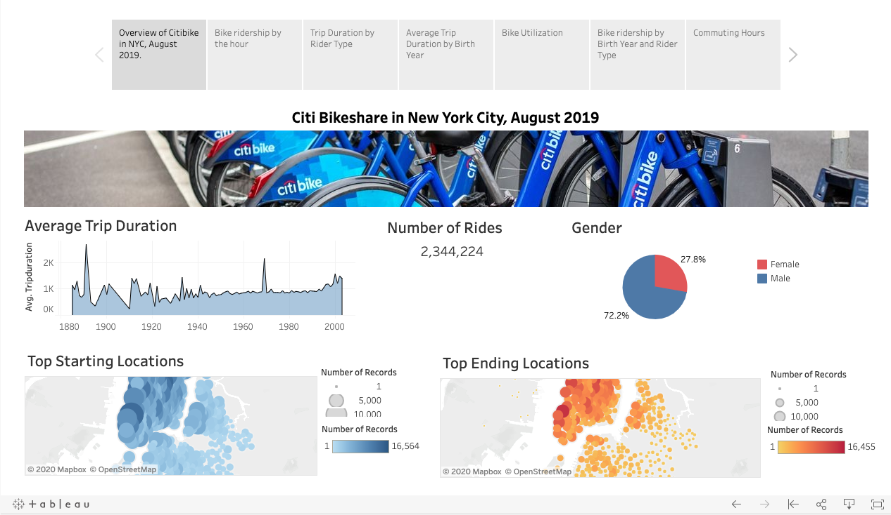

# Bikesharing
Create worksheets, dashboards, stories from New York City bike-sharing data.

# Citibike NYC Analysis
The citibike program in New York City seems to be thriving based on a recent analysis of bike ridesharing data from August 2019. Among the 2 million rides, bike sharing was largely dominated by male riders at 72.2%. The average trip duration tends to be similar for riders born 1960s-1980 (despite the hike in 1969). There is small upward trend among millennials.

# Citebike Des Moines Potential
Citibike NYC showed there is a potential to expand bike sharing services to Des Moines, Iowa. Although bikesharing services is mostly utilized by male riders, female riders also tend to be consistent in their bike riding usage. According to the U.S. Census Bureau, De Moise's female population ratio appears to be similar to NYC's. De Moise is comprised of 50.8% female whereas NYC is comprised of 52.3%. This could be an indication that rideship among females in De Moise could lead to similar trends.

According to the De Moise's tourism website, there are three popular trails that would make ideal bike riding places for not only residents but tourists as well. Each trail is about a 6-9 mile ride which could attract bike enthusiasts. Lastly, De Moise's scenic outdoors, history, and culture could also attract ridership as they are eager to explore the riches of De Moise.

Visit my  for further analysis. Here's a glimpse:

# Sources
- https://www.census.gov/quickfacts/fact/table/newyorkcitynewyork,desmoinescityiowa,US/PST045219
- https://www.catchdesmoines.com/things-to-do/outdoor/trails/
- https://assets.simpleviewinc.com/simpleview/image/upload/v1/clients/desmoines/HistorialandHillyNeighborhoods_61d16f02-f66c-4dc7-ad8c-132fd7cfb51e.pdf
- https://assets.simpleviewinc.com/simpleview/image/upload/v1/clients/desmoines/PintSizeTour_5fb5c60d-2e78-4f0d-9913-7f168fc79479.pdf
- https://assets.simpleviewinc.com/simpleview/image/upload/v1/clients/desmoines/DesMoinesBehindHandlebars_6a320bff-ba79-4f89-ae5a-3ea12e0e326c.pdf
